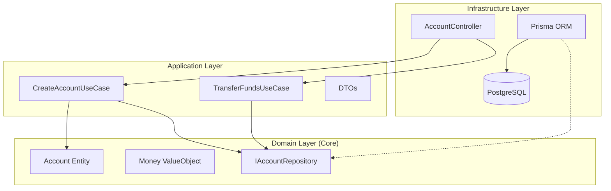

# 🏦 Financial Management API


> **Uma API robusta e escalável para gestão de transações financeiras, construída com os mais altos padrões de engenharia de software.**

---

## 🚀 Sobre o Projeto

Este projeto é uma demonstração de **arquitetura de software moderna** aplicada a um domínio crítico: o financeiro. O objetivo não é apenas "fazer funcionar", mas garantir **corretude, manutenibilidade e escalabilidade**.

A aplicação gerencia contas e transferências monetárias, garantindo a integridade dos dados através de **transações atômicas** e regras de negócio encapsuladas no domínio.

### ✨ Destaques Técnicos (Por que este projeto é diferente?)

*   **Clean Architecture & DDD**: O código é desacoplado. O núcleo da aplicação (Domínio) não depende de frameworks ou bancos de dados. Isso permite testabilidade e flexibilidade.
*   **Tratamento de Erros Funcional**: Utilização do padrão **Result/Either (Monads)** para lidar com erros de forma explícita e previsível, evitando o "caos" de exceções não tratadas.
*   **Value Objects**: O dinheiro não é apenas um `number`. É um **Value Object** que encapsula regras de validação e operações aritméticas seguras, prevenindo erros de arredondamento e lógica.
*   **Segurança e Consistência**: Validações rigorosas na entrada (DTOs) e no coração do sistema (Entidades), garantindo que o estado da aplicação seja sempre válido.

---

## 🛠️ Tech Stack

*   **Core**: [Node.js](https://nodejs.org/), [NestJS](https://nestjs.com/), [TypeScript](https://www.typescriptlang.org/)
*   **Database**: [PostgreSQL](https://www.postgresql.org/), [Prisma ORM](https://www.prisma.io/)
*   **Infra**: [Docker](https://www.docker.com/), Docker Compose
*   **Testing**: [Jest](https://jestjs.io/), Supertest
*   **Docs**: [Swagger / OpenAPI](https://swagger.io/)

---

## 🏗️ Arquitetura

O projeto segue estritamente a **Clean Architecture**, dividindo as responsabilidades em camadas concêntricas:



---

## ⚡ Como Executar

### Pré-requisitos
*   Node.js (v18+)
*   Docker & Docker Compose

### 1. Instalação
```bash
# Clone o repositório
git clone https://github.com/icarogoggin/api_sistema_financeiro.git

# Entre na pasta
cd api_sistema_financeiro

# Instale as dependências
npm install
```

### 2. Rodando com Docker (Recomendado)
Suba o banco de dados PostgreSQL em segundos:
```bash
docker-compose up -d
```

### 3. Configuração do Banco
```bash
# Gere o cliente do Prisma
npx prisma generate

# (Opcional) Execute as migrações se necessário
# npx prisma migrate dev
```

### 4. Inicie a API
```bash
npm run start:dev
```
A API estará rodando em `http://localhost:3000`.

---

## 🧪 Testes

A qualidade é garantida por uma suíte de testes automatizados.

*   **Testes Unitários**: Validam as regras de negócio isoladas (Entidades e Value Objects).
    ```bash
    npm run test
    ```
*   **Testes E2E (Integração)**: Validam os fluxos completos da API (Controllers -> UseCases).
    ```bash
    npm run test:e2e
    ```

---

## 📚 Documentação (Swagger)

A documentação interativa da API é gerada automaticamente.
Após iniciar a aplicação, acesse:

👉 **[http://localhost:3000/api](http://localhost:3000/api)**

---

## 🎮 Demonstração Rápida (Sem Docker)

Quer ver o código rodando agora mesmo, sem configurar nada?
Execute o script de demonstração que utiliza um repositório em memória:

```bash
npx ts-node --project tsconfig.demo.json demo.ts
```
Isso simulará a criação de contas e transferências no seu terminal.

---

Developed with 💜 by **Ícaro Goggin**
